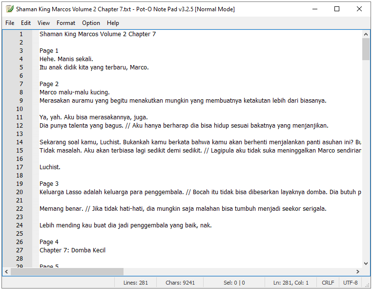

# Pot-O Note Pad

**Pot-O Note Pad** is a desktop text and code editor built for Windows. It is developed using Python, PyQt5, and QScintilla, offering a feature set that bridges the gap between a basic Notepad and a lightweight IDE. 

This editor supports syntax highlighting for various programming languages, advanced find-and-replace, formatting tools, printing, PDF export, drag-and-drop file support, and more—all within a familiar, Windows-native interface.

---

## 💡 What This Is

Pot-O Note Pad aims to provide:

- Clean and responsive interface based on classic Windows applications
- Syntax highlighting for 30+ languages using QScintilla lexers
- Print, Print Preview, Page Setup, and PDF Export support
- Advanced Find & Replace (regex, wrap-around, highlight-all)
- Auto-save and unsaved change detection
- Text formatting: tabs to spaces, case conversions, whitespace control
- Toolbar with file, edit, and formatting actions
- View-only mode with annotation capability
- Customizable themes, fonts, zoom levels, and line numbers
- Right-click context menu with rich editing actions

---

## 🖥 Build for Windows Only

This application is built and tested **exclusively for Windows**, and is compiled as a **32-bit executable** using Python 3.11 (32-bit).

### 🛠 Minimum Requirements

Based on the source code structure and external dependencies, the following are required:

- **Windows 7 SP1**, 8, 10, or 11 (32-bit or 64-bit)
- **Python runtime not required** (bundled at compile time)
- Approximately **100 MB of available disk space** after installation
- System must support **GDI-based printing** and **Win32 GUI APIs**

---

## 📦 Installation

This software is distributed in **binary format only**.

### How to Install:

1. Download the latest version `.exe` installer from the [Releases](https://github.com/umarhasyimas/Pot_O-Note-Pad/releases) page.
2. Run the installer and follow the setup instructions.
3. Launch the application from the Start Menu or desktop shortcut.

> ✅ After installation, you may move the installed folder to another directory on the same machine. The application will still run, but initial installation is required.

---

## 🖼 Screenshots

Below are some previews of Pot-O Note Pad in action:

  
*Pot-O Note Pad in plain text editing mode*

  
*Code folding feature enabled*

  
*Language lexer selection menu*

  
*Toolbar with common editing actions*

  
*About dialog with license and creator information*

---

## 📄 License

This project is licensed under the [MIT License](./LICENSE).

Distribution of binary-only releases is permitted under the terms of the MIT license.

---

## 🔐 Source Code Availability

The full source code of Pot-O Note Pad is not published in this repository. Only compiled binaries are provided for public use.

If you are a developer or researcher and require access to the source for review or educational purposes, please contact the maintainer directly.

---

## 🧰 Built With

- Python 3.11 / 3.12 (32-bit)
- PyQt5 – User interface toolkit
- QScintilla – Advanced code editing component
- pywin32 – Integration with Windows printing APIs
- ReportLab – PDF export functionality

---

## 📫 Contact

For bug reports, feature requests, or source code inquiries:

- GitHub Website: [https://umarhasyimas.github.io](https://umarhasyimas.github.io/Pot_O-Note-Pad/)
- GitHub Repository:
[https://github.com/umarhasyimas](https://github.com/umarhasyimas/) 
- Email: [umarhasyimas@gmail.com]

---
